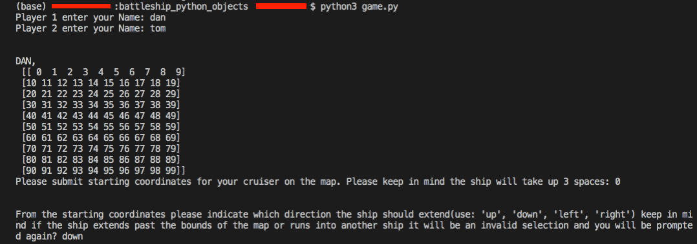

The following Project is a rough draft attempt at creating the battleship board game from scratch that runs on the command line and uses the NumPy Library to make a grid for coordinates. The game is pretty intuitive and doesn't have that many checks to sanitize user input so you will have to read the directions and comply in order to have the game work as intended.

This is an effort to practice Object Oriented Programming within Python. 

Run game.py and initialize players
Players must pick starting coordinates and then the direction they want the rest of their ship_length laid out

Each player's ship is referenced by a unique number on their said player_1.mymap.grid but this is hidden from view to mimic a blank screen in order to target opponent's ships

Then Player_1 is prompted to target opponent:

As you can see player_1 misses

Then player2 is prompted to target opponent:

Player_1 is asked to target again, note that you can see the previous missed strike with -5(arbitrary number) | -1 denotes a successful strike:

Player_2 prompted again(shows his successful previous strike with -1):

This repeats until all ships have been eliminated - this can be toggled to desire number in Player class, attribute ships left with updating the game with how many ships should be placed on the map.

